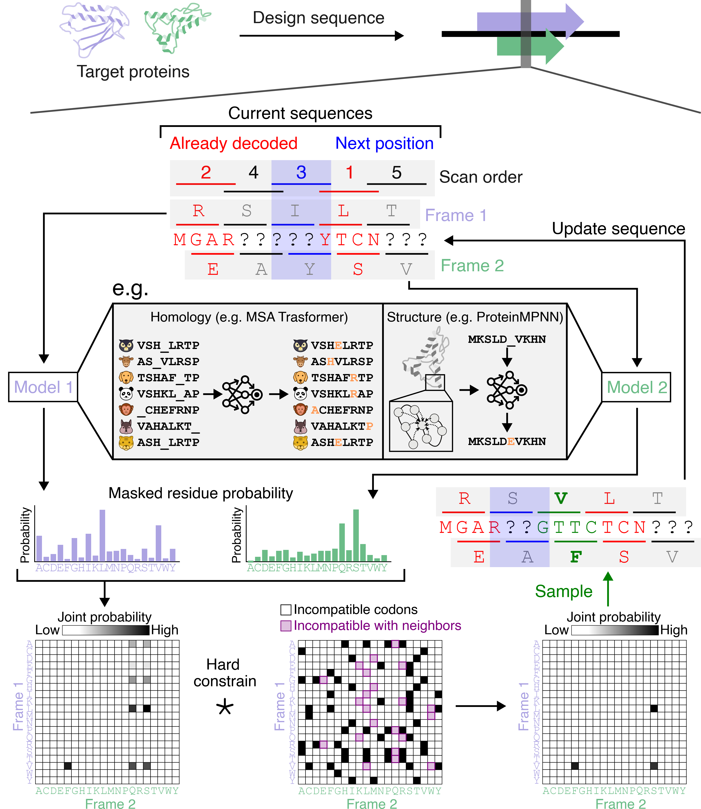
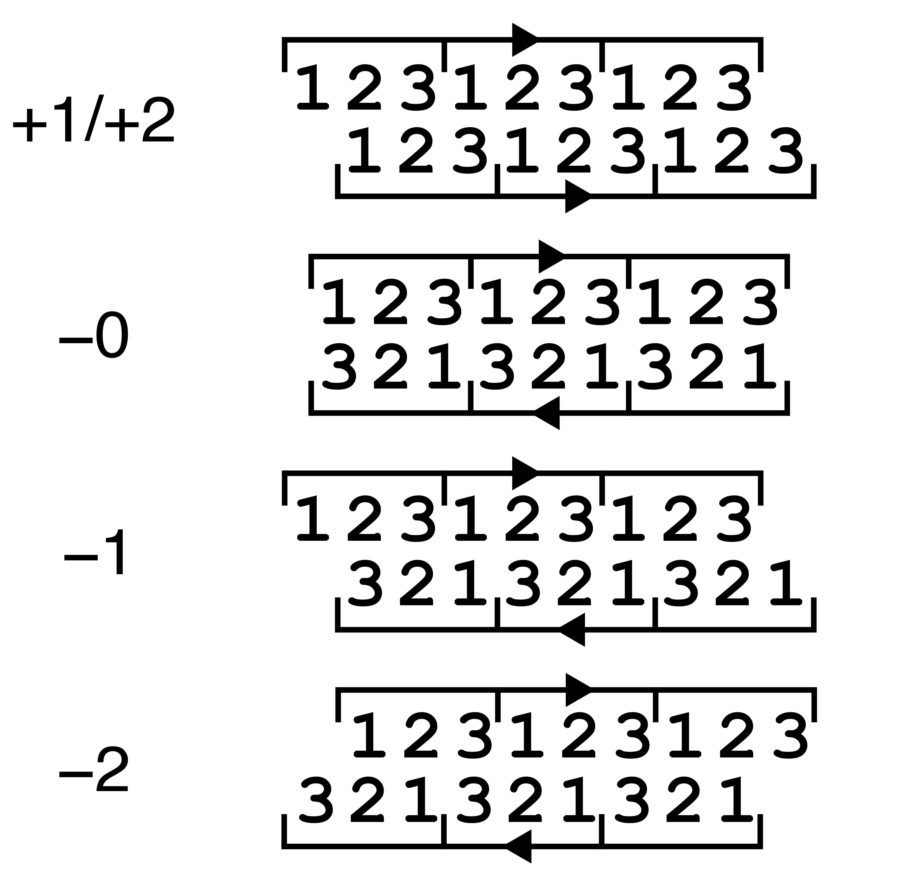

# OLGDesign: a computational framework for designing overlapping genes using generative models of protein sequences. 

This tool enables the simultaneous design of two proteins whose coding sequences overlap in different reading frames of the same nucleotide sequence.

## Overview

In nature, viruses frequently evolve overlapping genes (OLG) in alternate reading frames of the same nucleotide sequence despite the drastically reduced protein sequence space resulting from the sharing of codon nucleotides. Their existence leads one to wonder whether amino acid sequences are sufficiently degenerate with respect to protein folding to broadly allow arbitrary pairs of functional proteins to be overlapped. We investigate this question by engineering synthetic OLGs using state-of-the-art generative models. 

This framework provides an iterative constrained sampling algorithm to design overlapping sequences given an arbitrary target pair of proteins.



## Key Features

- **Post-hoc method, supports multiple different models**: Currently implemented are ProteinMPNN, EvoDiff-MSA, GREMLIN, ESM3, CoFlow, ProtMamba
- **Flexible arrangements**: All possible reading frame arrangement/strand
- **Customizable constraints**: Fixed/weighted positions, enforcing start/stop codons, amino acid biases, repeat penalties
- **Alternative genetic codes**: Specified or randomized genetic code tables
- **Sampling strategies**: Biasing the decoding orders, ex) by entropy

## Installation

### Prerequisites

```bash
# Core dependencies
pip install torch numpy biopython tqdm

# Additional model-specific dependencies as needed
```

### Setup

```bash
git clone <repository-url>
cd olgdesign
```

Download pre-trained model weights and place them in appropriate directories

## Usage

The `OLGDesign` class is the main interface for running the designs.

```python
class OLGDesign:
    def __init__(
        self,
        device: torch.device,
        arrangement: int = 0,
        offset: int = 0,
        decoding_mode: int = 0,
        seq_lens: Tuple[Optional[int], Optional[int]] = (None, None),
        seq_starts: Tuple[int, int] = (0, 0),
        codon_table: Union[str, Dict[str, str]] = "Standard",
        top_p: float = 0.0,
        temperature: float = 1.0,
        end_stop: Tuple[bool, bool] = (False, False),
        start: Tuple[bool, bool] = (False, False),
        start_codons: Tuple[List[str], List[str]] = (["ATG"], ["ATG"]),
        fixed_positions: Optional[List[Tuple[int, int, str]]] = None,
        gap_positions: Tuple[Optional[List[int]], Optional[List[int]]] = (None, None),
        repetition_penalty: Tuple[float, float] = (1.0, 1.0),
        repetition_penalty_window: Tuple[int, int] = (1, 1),
        logit_weight: Tuple[Optional[torch.Tensor], Optional[torch.Tensor]] = (None, None),
        logit_bias: Tuple[Optional[torch.Tensor], Optional[torch.Tensor]] = (None, None),
        aa_bias: Tuple[Optional[torch.Tensor], Optional[torch.Tensor]] = (None, None),
        truncate_topp: Tuple[Optional[float], Optional[float]] = (None, None),
        max_aa_count: Tuple[Optional[torch.Tensor], Optional[torch.Tensor]] = (None, None),
        max_pos_count: Tuple[Optional[float], Optional[float]] = (None, None),
        complexed: bool = False,
        shared: bool = False,
        balancer_max_weight: float = 2.0,
        balancer_unit: float = 0.5,
        balancer_threshold: float = 0.15,
        rand_base: Optional[int] = None,
        tqdm_disable: bool = False
    )
```

### Parameters
#### `device: torch.device`
```python
device = torch.device('cuda' if torch.cuda.is_available() else 'cpu')
```

#### `arrangement: int = 0`
Defines the alternative frames
- `0`: **+1 frame** 
- `1`: **-1 frame** 
- `2`: **-0 frame** 
- `3`: **+2 frame** 
- `4`: **-2 frame** 


#### `offset: int = 0`
Offset between the start positions of the two proteins (in amino acids). Must be positive. Frame 1 always starts at position 0, Frame 2 starts at `offset`. For arrangements 1, 2 and 4 (negative strand overlaps), 

#### `seq_lens: Tuple[int, int] = (None, None)`
**Required.**
Lengths of the two proteins `(frame1_length, frame2_length)`. 

#### `seq_starts: Tuple[int, int] = (0, 0)`
Starting offsets within each protein sequence `(frame1_start, frame2_start)`.

#### `codon_table: Union[str, Dict[str, str]] = "Standard"`
Genetic code table specification:
- **String**: Use predefined table from NCBI (e.g., "Standard", "Vertebrate Mitochondrial")
- **Dict**: Custom codon table mapping dictionary `{"ATG": "M", "TAA": "X", ...}`

### Sampling Parameters

#### `top_p: float = 0.0`
Top-p sampling cutoff for the joint amino acid probability matrix. 0.0 is greedy, 1.0 is full distribution. Defaults to 0.

#### `temperature: float = 1.0`
Temperature for sampling from the joint logit matrix:

#### `decoding_mode: int = 0`
To prioritizes overlapping region or not.
- `0`: **Random** - Fully random position order. Default.
- `1`: **Overlap-first** - Prioritize overlapping regions
- `2`: **Overlap-last** - Decode overlapping regions last

### Sequence Constraints

#### `end_stop: Tuple[bool, bool] = (False, False)`
Whether to add stop codons at the end of each protein `(frame1_stop, frame2_stop)`.

#### `start: Tuple[bool, bool] = (False, False)`
Whether to enforce start codons at the beginning of each protein `(frame1_start, frame2_start)`.

#### `start_codons: Tuple[List[str], List[str]] = (["ATG"], ["ATG"])`
To allow non-canonical start codons for each frame `(frame1_codons, frame2_codons)`.
```python
# Different start codons for each frame
start_codons=(["ATG", "GTG"], ["ATG"])
```

#### `fixed_positions: Optional[List[Tuple[int, int, str]]] = None`
Fix specific amino acids at designated positions. Format: `[(frame, position, amino_acid), ...]`
```python
fixed_positions = [
    (0, 10, 'M'),  # Frame 1, position 10 (1-indexed), Methionine
    (1, 5, 'W'),   # Frame 2, position 5, Tryptophan
    (0, 25, 'P')   # Frame 1, position 25, Proline
]
```

#### `gap_positions: Tuple[Optional[List[int]], Optional[List[int]]] = (None, None)`
Positions to treat as gaps in MSA inputs `(frame1_gaps, frame2_gaps)`. 1-indexed positions.

### Sampling Control

#### `repetition_penalty: Tuple[float, float] = (1.1, 1.1)`
Penalty for repeating amino acids `(frame1_penalty, frame2_penalty)`
- `1.0`: No penalty
- `> 1.0`: Penalize repetitions

Penalty is repetition_penalty**n_repeat

#### `repetition_penalty_window: Tuple[int, int] = (4, 4)`
Window size for repetition penalty calculation `(frame1_window, frame2_window)`.

#### `logit_weight: Tuple[Optional[torch.Tensor], Optional[torch.Tensor]] = (None, None)`
Per-position weights for logits `(frame1_weights, frame2_weights)`. Shape: `[seq_length]`

#### `logit_bias: Tuple[Optional[torch.Tensor], Optional[torch.Tensor]] = (None, None)`
Position-specific amino acid biases `(frame1_bias, frame2_bias)`. Shape: `[seq_length, 21]`

#### `truncate_topp: Tuple[Optional[float], Optional[float]] = (None, None)`
Top-p cutoff for individual protein logits, **before** joint calculation `(frame1_topp, frame2_topp)`.

### Composition Constraints

#### `aa_bias: Tuple[Optional[torch.Tensor], Optional[torch.Tensor]] = (None, None)`
Global amino acid biases `(frame1_bias, frame2_bias)`. Shape: `[21]`
```python
# Ban cysteine globally
aa_bias = torch.zeros(21)
aa_bias[1] = -1000.0  # C is index 1 in ALPHABET
```

#### `max_aa_count: Tuple[Optional[torch.Tensor], Optional[torch.Tensor]] = (None, None)`
Maximum count for each amino acid type `(frame1_max, frame2_max)`. Shape: `[21]`

#### `max_pos_count: Tuple[Optional[int], Optional[int]] = (None, None)`
Maximum total count of positively charged residues (H, K, R) `(frame1_max, frame2_max)`.

### Model-specific parameters

#### `complexed: bool = False`
Enable tied decoding for ProteinMPNN when designing protein complexes with symmetric interactions.

#### `shared: bool = False`
Enable split MSA decoding for models with MSA when frames should share MSA context.

### Iterative refinement parameters

#### `balancer_max_weight: Optional[float] = 2.0`
Maximum weight for balancing the two frames

#### `balancer_unit: Optional[float] = 0.5`
Increment unit for balancing the two frames

#### `balancer_threshold: Optional[float] = 0.15`
Threshold value for difference in scores for the two frames to trigger balancing weight
            
### Others

#### `rand_base: Optional[int] = None`
Random seed for reproduction.

#### `tqdm_disable: bool = False`
Disable progress bars during decoding for cleaner output in batch processing.

## Quick Start

An example for simple monomer scaffold overlaps with ProteinMPNN:
```python
from olgdesign import *

device = torch.device("cuda:0")

#Test ProteinMPNN
proteinmpnn_model = load_proteinmpnn_model("./proteinmpnn_weights/ca_model_weights/v_48_010.pt", device, ca_only=True)
pdb_1 = "./pdb_1.pdb"
pdb_2 = "./pdb_2.pdb"

#Initialize the helper class
design = OLGDesign(device,
                   arrangement=0,
                   offset=0,
                   seq_lens=(100, 100),
                   codon_table="Standard",
                   max_aa_count=(25, 25),
                   decoding_mode=1,
                   repetition_penalty=(1.1, 1.1),
                   repetition_penalty_window=(4, 4),
                   balancer_max_weight=2.0,
                   balancer_threshold=0.15,
                   balancer_unit=0.5)

#Reset the wrappers
design.reset_decoder_ProteinMPNN(frame=0, model=proteinmpnn_model, ca_only=True, pdb_path=pdb_1)
design.reset_decoder_ProteinMPNN(frame=1, model=proteinmpnn_model, ca_only=True, pdb_path=pdb_2)

design.decode_all() #First design pass

#Track the results and scores
nuc_seq, _ = design.string_quartet()
prot_f1, prot_f2 = design.get_prot_seq()
seqs = [ [ prot_f1, prot_f2 ] ]

score_f1, score_f2 = design.get_scores()
scores_pll = [ [ score_f1, score_f2 ] ]

#We will now keep repeating the design passes, using position orders biased by entropy and using a weighting scheme to balance the scores of the two frames.
n_iter = 9 #Refine up to n_iter passes
for i in range(n_iter): 
    ordering = design.get_next_order("entropy") #Calculates the position orders based on previous scan.
    w1, w2 = design.get_next_weight(scores_pll) #Calculates weight to balance the two frames
    design.decode_all_gibbs(next_order=ordering, weight=(w1, w2)) #Next design pass

    #Track the results and scores
    nuc_seq, _ = design.string_quartet()
    prot_f1, prot_f2 = design.get_prot_seq()
    seqs += [ [ prot_f1, prot_f2 ] ]
    
    score_f1, score_f2 = design.get_scores()
    scores_pll += [ [ score_f1, score_f2 ] ]
    
best_ind = torch.stack([ torch.stack(s) for s in scores_pll ]).max(1)[0].argmin().item() #Best scoring index by worse of the pairs

```

## Repo file Structure

```
├── olgdesign.py              # Main OLGDesign class
├── constants.py              
├── utils.py                  
├── genetic_code_randomizer.py # For alternative genetic code generation
├── gremlin.py               # Barebone GREMLIN model in torch
├── wrappers/                # Model wrapper classes
│   ├── proteinmpnn.py
│   ├── evodiff.py
│   ├── gremlin.py
│   ├── esm3.py
│   ├── coflow.py
│   └── protmamba.py
└── README.md
```

## Citation

If you use this framework in your research, please cite:

```bibtex
@article{https://doi.org/10.1101/2025.05.06.652464,
  title={Design of overlapping genes using deep generative models of protein sequences},
  author={[Authors]},
  journal={[Journal]},
  year={[Year]}
}
```
