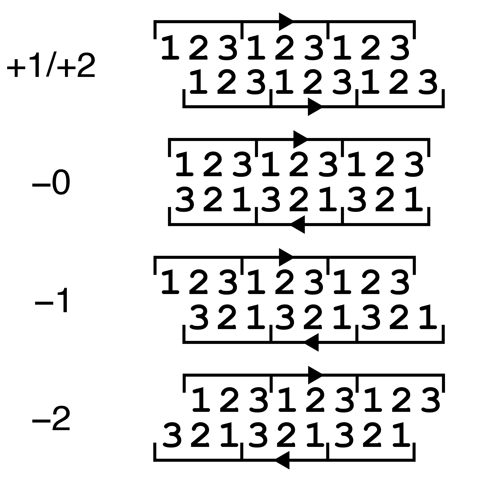

# OLGDesign: a computational framework for designing overlapping genes using generative models of protein sequences. 

This tool enables the simultaneous design of two proteins whose coding sequences overlap in different reading frames of the same nucleotide sequence.

## Overview

In nature, viruses frequently evolve overlapping genes (OLG) in alternate reading frames of the same nucleotide sequence despite the drastically reduced protein sequence space resulting from the sharing of codon nucleotides. Their existence leads one to wonder whether amino acid sequences are sufficiently degenerate with respect to protein folding to broadly allow arbitrary pairs of functional proteins to be overlapped. We investigate this question by engineering synthetic OLGs using state-of-the-art generative models. 

This framework provides an iterative constrained sampling algorithm to design overlapping sequences given an arbitrary target pair of proteins.


## Key Features

- **Post-hoc method, supports multiple different models**: Currently implemented are ProteinMPNN, EvoDiff-MSA, GREMLIN, ESM3, CoFlow, ProtMamba
- **Flexible arrangements**: All possible reading frame arrangement/strand
- **Customizable constraints**: Fixed/weighted positions, enforcing start/stop codons, amino acid biases, repeat penalties
- **Alternative genetic codes**: Specified or randomized genetic code tables
- **Sampling strategies**: Biasing the decoding orders, ex) by entropy

## Installation

### Prerequisites

```bash
# Core dependencies
pip install torch numpy biopython tqdm

# Additional model-specific dependencies as needed
```

### Setup

```bash
git clone <repository-url>
cd olg
```

Download pre-trained model weights and place them in appropriate directories

## Configuration

The design process is controlled through two main configuration classes: `DesignConfig` and `ProteinConfig`

### DesignConfig Parameters

Main overlap configuration
```python
from config import DesignConfig, ProteinConfig, Arrangement, DecodingMode

config = DesignConfig(
    device=torch.device("cuda:0"),  # Computing device
    arrangement=Arrangement.PLUS_ONE,  # Frame arrangement
    offset=0,  # Distance between N-termini
    protein1=ProteinConfig(...),  # Protein 1 configuration
    protein2=ProteinConfig(...),  # Protein 2 configuration
    codon_table="Standard",  # Genetic code
    decoding_mode=DecodingMode.OVERLAP_FIRST,  # Decoding strategy
    temperature=1.0,  # Sampling temperature
    top_p=0.0,  # Top-p sampling threshold
    complexed=False,  # Tied decoding for complexes
    shared=False,  # Split MSA decoding
    balancer_max_weight=2.0,  # Maximum balancing weight
    balancer_unit=0.5,  # Balancing increment
    balancer_threshold=0.15,  # Balancing trigger threshold
    rand_base=None,  # Random seed
    tqdm_disable=False  # Disable progress bars
)
```

### Parameters
#### `device: torch.device`
```python
device = torch.device('cuda' if torch.cuda.is_available() else 'cpu')
```

#### `arrangement: int = 0`
- `Arrangement.PLUS_ONE` (0): Protein 2 in +1 frame
- `Arrangement.MINUS_ONE` (1): Protein 2 in -1 frame (reverse strand)
- `Arrangement.MINUS_ZERO` (2): Protein 2 in -0 frame (reverse strand, in-phase)
- `Arrangement.PLUS_TWO` (3): Protein 2 in +2 frame
- `Arrangement.MINUS_TWO` (4): Protein 2 in -2 frame (reverse strand)


#### `offset: int = 0`
Offset between the start positions of the two proteins (in amino acids). Must be positive. Frame 1 always starts at position 0, Frame 2 starts at `offset`. For arrangements 1, 2 and 4 (negative strand overlaps), do L-overlap_length.

#### `codon_table: Union[str, Dict[str, str]] = "Standard"`
Genetic code table specification:
- **String**: Use predefined table from NCBI (e.g., "Standard", "Vertebrate Mitochondrial")
- **Dict**: Custom codon table mapping dictionary `{"ATG": "M", "TAA": "X", ...}`

#### `decoding_mode: int = 1`
To prioritizes overlapping region or not.
- `DecodingMode.RANDOM` (0): Random order
- `DecodingMode.OVERLAP_FIRST` (1): Prioritize overlap region
- `DecodingMode.OVERLAP_LAST` (2): Deprioritize overlap region

#### `temperature: float = 1.0`
Temperature for sampling from the joint logit matrix:

#### `top_p: float = 0.0`
Top-p sampling cutoff for the joint amino acid probability matrix. 0.0 is greedy, 1.0 is full distribution. Defaults to 0.

#### `complexed: bool = False`
Enable tied decoding for ProteinMPNN when designing protein complexes with symmetric interactions.

#### `shared: bool = False`
Enable split MSA decoding for models with MSA when frames should share MSA context.

#### `balancer_max_weight: Optional[float] = 2.0`
Maximum weight for balancing the two frames in iterative refinement

#### `balancer_unit: Optional[float] = 0.5`
Increment unit for balancing the two frames

#### `balancer_threshold: Optional[float] = 0.15`
Threshold value for difference in scores for the two frames to trigger balancing weight
            
#### `rand_base: Optional[int] = None`
Random seed for reproduction.

#### `tqdm_disable: bool = False`
Disable progress bars

### ProteinConfig Parameters

Per-protein configuration:
```python
protein1_config = ProteinConfig(
    device=torch.device("cuda:0"),
    length=100,  # Protein length (overlap region only if partial)
    start_offset=0,  # Offset for partial sequences
    force_stop=False,  # Enforce stop codon
    force_start=False,  # Enforce start codon
    start_codons=["ATG"],  # Valid start codons
    fixed_positions=[(5, "M"), (10, "W")],  # Fixed residues (1-indexed)
    gap_positions=[15, 20],  # Gap positions for alignment (1-indexed)
    
    # Sampling constraints
    repetition_penalty=1.1,  # Penalty for repeated amino acids
    repetition_penalty_window=4,  # Window size for repetition check
    logit_weight=torch.ones(100),  # Per-position weights
    logit_bias=torch.zeros(100, 21),  # Position-specific AA biases
    aa_bias=torch.zeros(21),  # Position-invariant AA biases
    truncate_topp=0.0,  # Top-p for individual protein
    max_aa_count=torch.ones(21) * 1000,  # Maximum count per AA
    max_pos_count=1000,  # Maximum positive charge count
)
```

#### `device: torch.device`
```python
device = torch.device('cuda' if torch.cuda.is_available() else 'cpu')
```

#### `length:int = 100`
**Required.**
Lengths of the protein. 

#### `start_offset: int = 0`
Starting offsets within each protein sequence

#### `force_stop: bool = False`
Whether to add stop codons at the end of each protein.

#### `force_start: bool = False`
Whether to enforce start codons at the beginning of each protein.

#### `start_codons: List[str] = [ "ATG" ]`
To allow non-canonical start codons for each frame.

#### `fixed_positions: Optional[List[Tuple[int, str]]] = None`
Fix specific residues to specific amino acids  
Format: `[(position, amino_acid), ...]` where position is 1-indexed  
Example: `[(1, "M"), (50, "W"), (100, "F")]`

#### `gap_positions: Optional[List[int]] = None`
Positions to treat as gaps in MSA inputs. 1-indexed positions.

#### `repetition_penalty: float = 1.1`
Penalty for repeating amino acids`
- `1.0`: No penalty
- `> 1.0`: Penalize repetitions

Penalty is repetition_penalty**n_repeat

#### `repetition_penalty_window: int = 4`
Window size for repetition penalty calculation.

#### `logit_weight: Optional[torch.Tensor] = None`
Per-position weights for logits. Shape: `[seq_length]`

#### `logit_bias: Optional[torch.Tensor] = None`
Position-specific amino acid biases. Shape: `[seq_length, 21]`

#### `truncate_topp: Optional[float] = None`
Top-p cutoff for individual protein logits, **before** joint calculation.

#### `aa_bias: Optional[torch.Tensor] = None`
Global amino acid biases. Shape: `[21]`

#### `max_aa_count: Optional[torch.Tensor] = None`
Maximum count for each amino acid type. Shape: `[21]`

#### `max_pos_count: Optional[int] = None`
Maximum total count of positively charged residues (H, K, R).

## Quick Start

An example for simple monomer scaffold overlaps with ProteinMPNN:
```python
from olgdesign import *

device = torch.device("cuda:0")

#Test ProteinMPNN
proteinmpnn_model = WrapperProteinMPNN._load_proteinmpnn_model("./proteinmpnn_weights/ca_model_weights/v_48_010.pt", device, ca_only=True)
pdb_1 = "./pdb_1.pdb"
pdb_2 = "./pdb_2.pdb"

config = DesignConfig()
olg = OLGDesign(config)

olg.initialize_decoder(decoder_type="ProteinMPNN", frame=0, model=proteinmpnn_model, ca_only=True, pdb_path=pdb_1)
olg.initialize_decoder(decoder_type="ProteinMPNN", frame=1, model=proteinmpnn_model, ca_only=True, pdb_path=pdb_2)

with (
    torch.inference_mode(),
    torch.autocast(device_type='cuda', dtype=torch.float16)
):
    olg.decode_all() #First design pass
    
    #Track the results and scores
    nuc_seq, _ = olg.string_quartet()
    prot_f1, prot_f2 = olg.get_prot_seq()
    seqs = [ [ prot_f1, prot_f2 ] ]
    
    score_f1, score_f2 = olg.get_scores()
    scores_pll = [ [ score_f1, score_f2 ] ]

    print(prot_f1, prot_f2)
    print(scores_pll[-1])
    
    #We will now keep repeating the design passes, using position orders biased by entropy and using a weighting scheme to balance the scores of the two frames.
    n_iter = 9 #Refine up to n_iter passes
    for i in range(n_iter): 
        ordering = olg.get_next_order("entropy") #Calculates the position orders based on previous scan.
        w1, w2 = olg.get_next_weight(scores_pll) #Calculates weight to balance the two frames
        olg.decode_all_gibbs(next_order=ordering, weight=(w1, w2)) #Next design pass
    
        #Track the results and scores
        nuc_seq, _ = olg.string_quartet()
        prot_f1, prot_f2 = olg.get_prot_seq()
        seqs += [ [ prot_f1, prot_f2 ] ]
        
        score_f1, score_f2 = olg.get_scores()
        scores_pll += [ [ score_f1, score_f2 ] ]

        print(prot_f1, prot_f2)
        print(scores_pll[-1])

best_ind = torch.stack([ torch.stack(s) for s in scores_pll ]).max(1)[0].argmin().item() #Best scoring index by worse of the pairs

```

## Repo file Structure

```
├── olgdesign.py              # Main OLGDesign class
├── constants.py              
├── config.py    
├── compatibility.py                  
├── coordinates.py
├── genetic_code_randomizer.py # For alternative genetic code generation
├── wrappers/                # Model wrapper classes
│   ├── proteinmpnn.py
│   ├── evodiff.py
│   ├── gremlin.py
│   ├── esm3.py
│   └── coflow.py
└── README.md
```

## Citation

If you use this framework in your research, please cite:

```bibtex
@article{https://doi.org/10.1101/2025.05.06.652464,
  title={Design of overlapping genes using deep generative models of protein sequences},
  author={[Authors]},
  journal={[Journal]},
  year={[Year]}
}
```


