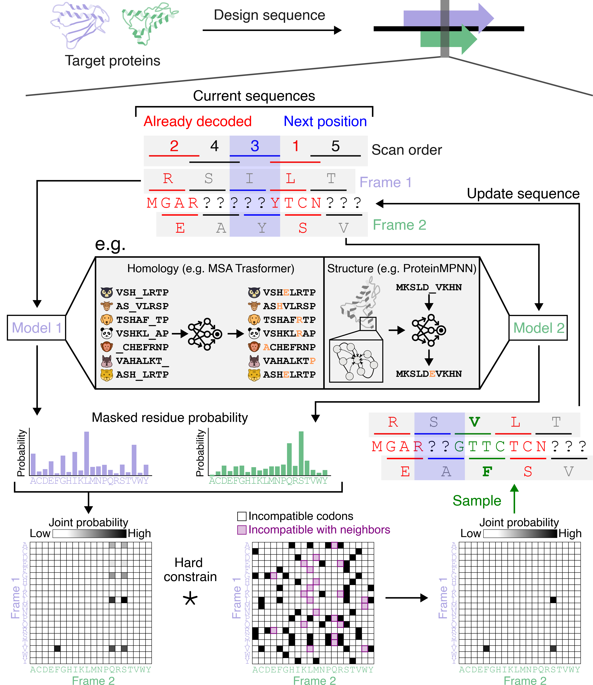

# OLG: Overlapping Gene Design

Design two proteins whose coding sequences overlap in different reading frames of the same DNA.



## Background

This framework uses generative protein models to design synthetic OLGs. The core algorithm is an iterative constrained sampling procedure over quartet positions (4-nucleotide windows that span two codons in overlapping frames), using model logits from both frames simultaneously.

## Supported models

| Model | Frame types | Notes |
|-------|------------|-------|
| **ProteinMPNN** | Structure-conditioned | Supports complexes via tied decoding |
| **ESM3** | Structure/sequence-conditioned | Requires `esm` package |
| **CoFlow** | Structure-conditioned | Requires `coflow` package |
| **EvoDiff-MSA** | MSA-conditioned | Requires `evodiff` package; supports shared MSA mode |
| **GREMLIN** | MSA-conditioned | Built-in, no extra deps |
| **ZeroOrder** | Sequence frequency baseline | Built-in |

Any combination of models can be used (one per frame).

## Installation

```bash
pip install -e .

```

## Quick start

```python
import torch
from olg import *
from olg.config import DesignConfig
from olg.wrappers.proteinmpnn import WrapperProteinMPNN

device = torch.device("cuda:0")

# Load model
model = WrapperProteinMPNN._load_proteinmpnn_model(
    "weights/proteinmpnn/v_48_010.pt", device, ca_only=True
)

# Configure
config = DesignConfig.from_yaml("my_design.yaml")  # or DesignConfig() for defaults
olg = OLGDesign(config)

# Initialize both frames
olg.initialize_decoder("ProteinMPNN", frame=0, model=model, ca_only=True, pdb_path="scaffold_1.pdb")
olg.initialize_decoder("ProteinMPNN", frame=1, model=model, ca_only=True, pdb_path="scaffold_2.pdb")

# Design
with torch.inference_mode():
    olg.decode_all()

    scores = [[*olg.get_scores()]]
    for i in range(9):
        order = olg.get_next_order("entropy")
        w1, w2 = olg.get_next_weight(scores)
        olg.decode_all_gibbs(next_order=order, weight=(w1, w2))
        scores.append([*olg.get_scores()])

    prot_f1, prot_f2 = olg.get_prot_seq()
    nuc_seq, _ = olg.string_quartet()
```

## Configuration

All defaults live in `src/olg/base.yaml`. User YAML files only need to specify overrides:

```yaml
# my_design.yaml
temperature: 0.1
arrangement: 0
protein1:
  length: 120
  repetition_penalty: 1.2
protein2:
  length: 95
  force_stop: true
```

Load with `DesignConfig.from_yaml("my_design.yaml")`. Calling `DesignConfig.from_yaml()` with no arguments returns base defaults.

### Design-level parameters

| Parameter | Default | Description |
|-----------|---------|-------------|
| `device` | `cuda:0` | Torch device |
| `arrangement` | `0` | Reading frame arrangement (see below) |
| `offset` | `0` | Distance between protein N-termini (in amino acids) |
| `codon_table` | `Standard` | NCBI genetic code name, or a `{codon: AA}` dict |
| `decoding_mode` | `1` | `0`=random, `1`=overlap first, `2`=overlap last |
| `temperature` | `1.0` | Sampling temperature for joint logits |
| `top_p` | `0.0` | Top-p nucleus sampling (`0.0`=greedy) |
| `complexed` | `false` | Tied decoding for ProteinMPNN multimers |
| `shared` | `false` | Shared MSA mode for EvoDiff |
| `balancer_max_weight` | `2.0` | Max frame-balancing weight |
| `balancer_unit` | `0.5` | Frame-balancing increment |
| `balancer_threshold` | `0.15` | Score difference to trigger rebalancing |
| `rand_base` | `null` | Random seed |
| `tqdm_disable` | `false` | Suppress progress bars |

### Per-protein parameters

| Parameter | Default | Description |
|-----------|---------|-------------|
| `length` | `100` | Protein length (overlap region only if partial) |
| `start_offset` | `0` | Starting position within the model input |
| `force_stop` | `false` | Enforce stop codon at C-terminus |
| `force_start` | `false` | Enforce start codon at N-terminus |
| `start_codons` | `["ATG"]` | Allowed start codons |
| `fixed_positions` | `null` | Fixed residues as `[[pos, "AA"], ...]` (1-indexed) |
| `gap_positions` | `null` | Gap positions for MSA models (1-indexed) |
| `repetition_penalty` | `1.1` | Penalty multiplier per repeated AA (`1.0`=off) |
| `repetition_penalty_window` | `4` | Window for repetition counting |
| `truncate_topp` | `0.0` | Per-protein top-p before joint calculation |
| `max_pos_count` | `10000` | Max positively charged residues (H, K, R) |

Tensor fields (`logit_weight`, `logit_bias`, `aa_bias`, `max_aa_count`) can be specified in YAML as inline lists or paths to `.pt`/`.npy` files. They default to uniform/zero and are omitted from `base.yaml`.

### Reading frame arrangements

| Value | Name | Description |
|-------|------|-------------|
| `0` | +1 | Protein 2 in +1 frame (same strand) |
| `1` | -1 | Protein 2 in -1 frame (reverse strand) |
| `2` | -0 | Protein 2 in -0 frame (reverse strand, in-phase) |
| `3` | +2 | Protein 2 in +2 frame (same strand) |
| `4` | -2 | Protein 2 in -2 frame (reverse strand) |

## Project structure

```
src/olg/
  design.py              # OLGDesign — main orchestrator
  config.py              # DesignConfig / ProteinConfig dataclasses + YAML I/O
  base.yaml              # Default configuration values
  constants.py           # Alphabets, quartets, codon tables, enums
  coordinates.py         # Frame coordinate mapping
  compatibility.py       # Codon compatibility constraints
  balancer.py            # Frame weight balancer
  exceptions.py          # Exception hierarchy
  genetic_code_randomizer.py  # Alternative genetic code generation
  wrappers/
    protocol.py          # DecoderProtocol (typing.Protocol)
    base_wrapper.py      # BaseWrapper mixin + ZeroOrderWrapper
    proteinmpnn.py       # ProteinMPNN wrapper
    esm3.py              # ESM3 wrapper
    coflow.py            # CoFlow wrapper
    evodiff.py           # EvoDiff-MSA wrapper
    gremlin.py           # GREMLIN wrapper
  structure/
    ph_boltz.py          # Boltz2 structure prediction wrapper
```

## Citation

```bibtex
@article{olg2025,
  title   = {Design of overlapping genes using deep generative models of protein sequences},
  author  = {},
  journal = {bioRxiv},
  year    = {2025},
  doi     = {10.1101/2025.05.06.652464}
}
```
