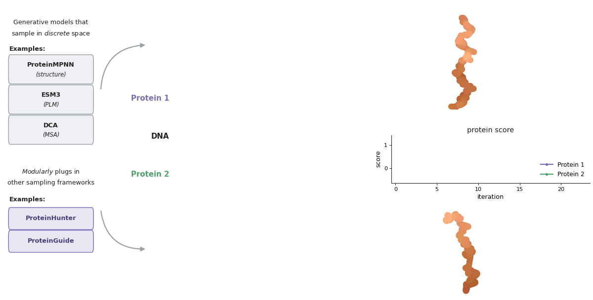

# OLGDesign

Design two proteins whose coding sequences overlap in different reading frames of the same DNA.



## Background

This framework uses generative protein models to design synthetic OLGs. The core algorithm is an iterative constrained sampling procedure over quartet positions (4-nucleotide windows that span two codons in overlapping frames), using model logits from both frames simultaneously.

## Supported models

| Model | Source | Notes |
|-------|--------|-------|
| **ProteinMPNN** | [dauparas/ProteinMPNN](https://github.com/dauparas/ProteinMPNN) | Built-in |
| **MSA Pairformer** | [yoakiyama/MSA_Pairformer](https://github.com/yoakiyama/MSA_Pairformer) | Requires `msa-pairformer` package |
| **ESM3** | [evolutionaryscale/esm](https://github.com/evolutionaryscale/esm) | Requires `esm` package |
| **EvoDiff-seq** | [microsoft/evodiff](https://github.com/microsoft/evodiff) | Requires `evodiff` package |
| **CoFlow** | [LtECoD/CoFlow](https://github.com/LtECoD/CoFlow) | Requires `coflow` package |
| **EvoDiff-MSA** | [microsoft/evodiff](https://github.com/microsoft/evodiff) | Requires `evodiff` package |
| **GREMLIN** | [sokrypton/GREMLIN_CPP](https://github.com/sokrypton/GREMLIN_CPP) | Built-in |
| **ZeroOrder** | — | Built-in (dummy uniform decoder) |

Any combination of models can be used (one per frame).

## Installation

```bash
pip install -e .

```

## Quick start

```python
import torch
from olg import *
from olg.config import DesignConfig
from olg.wrappers.proteinmpnn import WrapperProteinMPNN

device = torch.device("cuda:0")

# Load model
model = WrapperProteinMPNN._load_proteinmpnn_model(
    "weights/proteinmpnn/v_48_010.pt", device, ca_only=True
)

# Configure
config = DesignConfig.from_yaml("my_design.yaml")  # or DesignConfig() for defaults
olg = OLGDesign(config)

# Initialize both frames
olg.initialize_decoder("ProteinMPNN", frame=0, model=model, ca_only=True, pdb_path="scaffold_1.pdb")
olg.initialize_decoder("ProteinMPNN", frame=1, model=model, ca_only=True, pdb_path="scaffold_2.pdb")

# Design
with torch.inference_mode():
    olg.decode_all()

    scores = [[*olg.get_scores()]]
    for i in range(9):
        order = olg.get_next_order("entropy")
        w1, w2 = olg.get_next_weight(scores)
        olg.decode_all_gibbs(next_order=order, weight=(w1, w2))
        scores.append([*olg.get_scores()])

    prot_f1, prot_f2 = olg.get_prot_seq()
    nuc_seq, _ = olg.string_quartet()
```

## Configuration

All defaults live in `src/olg/base.yaml`. User YAML files only need to specify overrides:

```yaml
# my_design.yaml
temperature: 0.1
arrangement: 0
protein1:
  length: 120
  repetition_penalty: 1.2
protein2:
  length: 95
  force_stop: true
```

Load with `DesignConfig.from_yaml("my_design.yaml")`. Calling `DesignConfig.from_yaml()` with no arguments returns base defaults.

### Design-level parameters

| Parameter | Default | Description |
|-----------|---------|-------------|
| `device` | `cuda:0` | Torch device |
| `arrangement` | `0` | Reading frame arrangement (see below) |
| `offset` | `0` | Distance between protein N-termini (in amino acids) |
| `codon_table` | `Standard` | NCBI genetic code name, or a `{codon: AA}` dict |
| `decoding_mode` | `1` | `0`=random, `1`=overlap first, `2`=overlap last |
| `temperature` | `1.0` | Sampling temperature for joint logits |
| `top_p` | `0.0` | Top-p nucleus sampling (`0.0`=greedy) |
| `complexed` | `false` | Tied decoding for ProteinMPNN multimers |
| `shared` | `false` | Shared MSA mode for EvoDiff |
| `balancer_max_weight` | `2.0` | Max frame-balancing weight |
| `balancer_unit` | `0.5` | Frame-balancing increment |
| `balancer_threshold` | `0.15` | Score difference to trigger rebalancing |
| `rand_base` | `null` | Random seed |
| `tqdm_disable` | `false` | Suppress progress bars |

### Per-protein parameters

| Parameter | Default | Description |
|-----------|---------|-------------|
| `length` | `100` | Protein length (overlap region only if partial) |
| `start_offset` | `0` | Starting position within the model input |
| `force_stop` | `false` | Enforce stop codon at C-terminus |
| `force_start` | `false` | Enforce start codon at N-terminus |
| `start_codons` | `["ATG"]` | Allowed start codons |
| `fixed_positions` | `null` | Fixed residues as `[[pos, "AA"], ...]` (1-indexed) |
| `gap_positions` | `null` | Gap positions for MSA models (1-indexed) |
| `repetition_penalty` | `1.1` | Penalty multiplier per repeated AA (`1.0`=off) |
| `repetition_penalty_window` | `4` | Window for repetition counting |
| `truncate_topp` | `0.0` | Per-protein top-p before joint calculation |
| `max_pos_count` | `10000` | Max positively charged residues (H, K, R) |

Tensor fields (`logit_weight`, `logit_bias`, `aa_bias`, `max_aa_count`) can be specified in YAML as inline lists or paths to `.pt`/`.npy` files. They default to uniform/zero and are omitted from `base.yaml`.

## Extended alphabets

The OLG alphabet can be extended beyond the standard 20 amino acids + stop (`X`) to represent codon-level distinctions. A common case is splitting serine into two tokens based on which codons encode it, then restricting each frame to one group.

```python
from olg.constants import Constants, build_restricted_codon_table

# --- Codon table: reassign specific codons to new tokens ---
# AGT, AGC are taken from serine and reassigned to 'J'; TCN codons stay as 'S'.
# Any number of new letters and codon sets can be specified simultaneously.
codon_table = build_restricted_codon_table({"J": ["AGT", "AGC"]})

# Extend the alphabet with the new token. Any ordering is valid;
# indices are derived from letter identity, not position.
alphabet = list(Constants.DEFAULT_ALPHABET) + ["J"]
alphabet_index = {a: i for i, a in enumerate(alphabet)}

# --- Per-frame exclusion via aa_bias ---
# Setting aa_bias[idx] = MIN_LOGIT makes that token unsamplable in that frame.
p1_aa_bias = torch.zeros(len(alphabet), device=device)
p1_aa_bias[alphabet_index["S"]] = Constants.MIN_LOGIT   # frame 0: only J-serine (AGT/AGC)

p2_aa_bias = torch.zeros(len(alphabet), device=device)
p2_aa_bias[alphabet_index["J"]] = Constants.MIN_LOGIT   # frame 1: only S-serine (TCN)

# --- Config ---
config = DesignConfig(
    codon_table=codon_table,
    alphabet=alphabet,
    protein1=ProteinConfig(length=100, aa_bias=p1_aa_bias, ...),
    protein2=ProteinConfig(length=100, aa_bias=p2_aa_bias, force_start=True, ...),
)
olg = OLGDesign(config)

# --- extra_aa_map: tell the model wrapper how to score extended tokens ---
# ProteinMPNN has a fixed native vocabulary; map 'J' to native 'S' so it
# scores restricted-serine positions with the same logits as regular serine.
olg.initialize_decoder(
    "ProteinMPNN", frame=0, model=mpnn_model,
    ca_only=True, pdb_path="scaffold_1.pdb",
    extra_aa_map={"J": "S"},
)

# --- Translating the result ---
# Use translate_sequences() to recover S/J distinctions from the NT sequence.
# This is independent of the model wrapper vocabulary and handles all arrangements.
prot1, prot2 = olg.translate_sequences()
```

### Padding (extending proteins beyond PDB length)

When a designed protein needs to be longer than the PDB scaffold, the ProteinMPNN wrapper can inject dummy residues with NaN coordinates at the N- and/or C-terminus via the `pad` parameter. These positions get `mask=0` automatically (no structural contribution from the model), while biases and codon constraints still apply.

```python
# 100-residue PDB, but we want a 102-AA protein (1 extra on each end)
olg.initialize_decoder(
    "ProteinMPNN", frame=1, model=model,
    ca_only=True, pdb_path="scaffold.pdb",
    pad=(1, 1),  # (n_terminal, c_terminal)
)
# ProteinConfig.length must include padding: length=102
```

`config.length` **includes** padding — padded positions are real design positions in the final protein. To control amino acid selection at padded positions (where the model contributes no information), use `logit_weight` and `logit_bias`:

```python
# Zero out model logits at extension positions, bias toward S and G
logit_weight = torch.ones(length, device=device)
logit_bias = torch.zeros((length, alphabet_size), device=device)

for pos in extension_positions:
    logit_weight[pos] = 0.0
    logit_bias[pos, alphabet_index["S"]] = 1.0
    logit_bias[pos, alphabet_index["G"]] = 1.0

protein2 = ProteinConfig(
    length=length, logit_weight=logit_weight, logit_bias=logit_bias, ...
)
```

Padding is not supported with `tied=True` (complexes).

### Reading frame arrangements

| Value | Name | Description |
|-------|------|-------------|
| `0` | +1 | Protein 2 in +1 frame (same strand) |
| `1` | -1 | Protein 2 in -1 frame (reverse strand) |
| `2` | -0 | Protein 2 in -0 frame (reverse strand, in-phase) |
| `3` | +2 | Protein 2 in +2 frame (same strand) |
| `4` | -2 | Protein 2 in -2 frame (reverse strand) |

### Multi-chain context (binder design)

When designing an overlap protein that should bind a target, ProteinMPNN can condition on both the binder structure and the target structure simultaneously. Pass `fixed_chains` to keep target chains as structural context while designing only the binder chain:

```python
# Load a complex PDB with chain A (binder) and chain B (target)
olg.initialize_decoder(
    "ProteinMPNN", frame=1, model=model,
    ca_only=True, pdb_path="complex.pdb",
    fixed_chains=["B"],       # target structure as fixed context
    design_chains=["A"],      # binder chain to design
)
```

Fixed chains are encoded first in the autoregressive pass, so every logit prediction for the design chain is conditioned on the target's structure and sequence.

### MSA Pairformer

[MSA Pairformer](https://github.com/yoakiyama/MSA_Pairformer) is an MSA transformer that produces per-position amino acid logits from multiple sequence alignments. It also provides optional contact predictions (Cb-Cb and ConFind).

**Installation:**

```bash
git clone https://github.com/yoakiyama/MSA_Pairformer.git
pip install -e MSA_Pairformer
```

**Basic usage:**

```python
from olg.wrappers.msa_pairformer import WrapperMSAPairformer

# Load model (downloads weights from HuggingFace on first run)
model = WrapperMSAPairformer._load_model(device, weights_dir="weights/msa_pairformer")

# Parse MSA (list of aligned sequences from a3m/fasta file)
headers, seqs = WrapperMSAPairformer.parse_fasta("my_protein.a3m")
msa_seqs = [str(s) for s in seqs]

# Initialize decoder
olg.initialize_decoder(
    "MSAPairformer", frame=0, model=model,
    msa_seqs=msa_seqs,
    msa_n_seq=128,             # MSA depth (default 128; 64-256 recommended)
    msa_max_length=100,        # sequence length (must match config.length minus padding)
    msa_selection_type='MaxHamming',  # diversity selection: 'random', 'MaxHamming', 'MaxHammingI'
    seed_from_msa=True,        # seed query row from MSA (recommended)
)
```

**Key parameters:**

| Parameter | Default | Description |
|-----------|---------|-------------|
| `msa_n_seq` | `128` | MSA depth (64-256 recommended) |
| `msa_max_length` | — | Sequence length matching the MSA columns |
| `msa_selection_type` | `'random'` | `'MaxHamming'` for diverse subsampling |
| `seed_from_msa` | `False` | Seed query from MSA query sequence (recommended) |
| `use_bfloat16` | `True` | bfloat16 autocast for GPU inference |
| `pad` | `(0, 0)` | N/C-terminal padding (positions excluded from model, steered via `logit_weight`/`aa_bias`) |

**Contact predictions** (optional, outside DecoderProtocol):

```python
contacts = olg.decoders[0].get_contacts()
cb_contacts = contacts['cb_contacts']         # [1, L, L] Cb-Cb contacts
confind_contacts = contacts['confind_contacts']  # [1, L, L] interface contacts
```

**Notes:**
- Padding positions are trimmed before the model forward pass and zero-padded on output. Use `logit_weight=0` and `aa_bias` to steer padded positions.

### ESM3 with function conditioning

ESM3 supports function-conditioned generation via [InterPro](https://www.ebi.ac.uk/interpro/) annotations and keywords. This enables generating sequences with specific functional properties (e.g., antimicrobial activity) built into the generative model itself.

```python
olg.initialize_decoder(
    "ESM3", frame=0, model=esm3_model,
    function_annotations=[
        {"label": "IPR004275", "start": 1, "end": 23},   # Frog AMP propeptide
        {"label": "antimicrobial peptide", "start": 1, "end": 23},
    ],
)
```

AMP-related InterPro entries available in ESM3:

| InterPro ID | Description |
|------------|-------------|
| `IPR004275` | Frog antimicrobial peptide, propeptide |
| `IPR012520` | Frog antimicrobial peptide, brevinin-1 type |
| `IPR012521` | Frog antimicrobial peptide, brevinin-2/esculentin type |
| `IPR012524` | Abaecin, antimicrobial peptide |
| `IPR001542` | Defensin, invertebrate/fungal |
| `IPR010851` | Defensin-like protein |

Keywords: `antimicrobial`, `antimicrobial peptide`, `defensin`, `bacteriocin`.

Function conditioning can be combined with TAG guidance for dual control: ESM3 generates from the functional family distribution, while the classifier steers toward specific properties (e.g., potency, low hemolysis).

### Classifier-guided decoding (TAG)

The `GuidedWrapper` adds [Taylor-Approximated Guidance](https://arxiv.org/abs/2406.01572) to any decoder, biasing sampling toward sequences with desired properties (e.g., antimicrobial activity, low hemolysis) without modifying the base model.

```python
from olg.wrappers.guided import GuidedWrapper

# Initialize base decoder as usual
olg.initialize_decoder("MSAPairformer", frame=0, model=model, ...)

# Wrap with guidance
olg.decoders[0] = GuidedWrapper(
    olg.decoders[0],
    classifiers=[amp_classifier, hemo_classifier],
    guide_temp=0.5,          # lower = stronger guidance
    weights=[1.0, -1.0],    # maximize AMP activity, minimize hemolysis
)

# Design as normal — guidance is transparent to OLG
olg.decode_all()
```

The wrapper only intercepts `decode_next()` to add the classifier gradient signal. All state management, scoring, and sequence tracking delegates to the inner decoder. `get_score()` returns the unguided generative model score (for frame balancing); classifier scores should be evaluated separately.

**Classifier interface** — any classifier implementing `GuidanceClassifier`:

```python
class MyClassifier:
    vocab_size: int = 21                                # classifier's token vocabulary size
    olg_to_clf: torch.Tensor                            # [olg_alphabet_size] mapping
    def encode_tokens(self, token_ids) -> torch.Tensor: # native → classifier tokens
        ...
    def log_prob(self, x_onehot, t) -> torch.Tensor:   # [B, L, V] → [B] log probability
        ...
```

The classifier must accept one-hot input (`requires_grad=True`) and return a differentiable scalar log-probability. Use `StraightThroughEmbedding` to make embedding-based classifiers ([ESM-2](https://github.com/facebookresearch/esm), [ProtBERT](https://github.com/agemagician/ProtTrans)) differentiable through discrete tokens.

### Structure hallucination with Boltz2

The `structure/boltz.py` module wraps [Boltz2](https://github.com/jwohlwend/boltz) for structure prediction, adapted from [Protein-Hunter](https://github.com/yehlincho/Protein-Hunter). It supports both monomer fold prediction and multi-chain binder hallucination:

```python
from olg.structure.boltz import BoltzPHWrapper, BoltzPHConfig

# Load model (no_potentials=False enables contact steering for binder mode)
boltz_model = BoltzPHWrapper.load_model("boltz2_conf.ckpt", device, no_potentials=False)

# Configure for binder design
config = BoltzPHConfig(
    mode="binder",                         # multi-chain: A=binder, B=target
    protein_seqs="MKTLLF...",              # target protein sequence
    msa_mode="single",                     # or "mmseqs" for MSA search
    contact_residues="5,10,15",            # optional: pocket steering
    randomly_kill_helix_feature=True,      # encourage diverse folds
    ccd_path="weights/mols",
)

# Predict complex
boltz_ph = BoltzPHWrapper(boltz_model, config)
boltz_ph.reset()
output, structure = boltz_ph.run_prediction(binder_seq, "A", "complex.pdb")

# Extract binding metrics
iptm = BoltzPHWrapper.compute_iptm(output, "A")   # inter-chain TM-score
plddt = output["plddt"].mean().item()               # predicted LDDT
```

Binder hallucination tricks (from Protein-Hunter):
- **Multi-chain input**: target sequence as chain B; binder as chain A with "X" placeholder
- **Contact steering**: pocket constraints guide diffusion toward specific target residues
- **Helix killing**: disrupts i→i+4 pairwise features on the binder chain, encouraging diverse folds
- **ipTM tracking**: inter-chain predicted TM-score as the binding quality metric

**Iterating structure prediction ↔ ProteinMPNN (binder co-design).** `olg` ships both halves of Protein-Hunter's `num_cycles` loop — the Boltz2 wrapper and the ProteinMPNN frame decoder — so you can assemble it directly: hallucinate a starting complex, then iterate — redesign the binder with ProteinMPNN, predict the new sequence's structure, feed it back — keeping the best ipTM. Because the redesign step is the OLG frame decoder, the binder stays overlap-constrained the whole way.

```python
# Assumes `olg` (an OLGDesign for the overlap), `mpnn_model`, `boltz_model`,
# and `target_seq` are set up as in the sections above.
boltz_ph = BoltzPHWrapper(boltz_model, BoltzPHConfig(
    mode="binder", protein_seqs=target_seq, ccd_path="weights/mols"))
boltz_ph.reset()
target_chains = ["B"]          # target chain(s) in the complex; "A" is the binder

# Seed: hallucinate a complex for a random binder, then condition ProteinMPNN on it
boltz_out, _ = boltz_ph.run_prediction(
    BoltzPHWrapper.sample_seq(core_length), "A", "iter0.pdb")   # core_length = binder length
olg.initialize_decoder("ProteinMPNN", frame=1, model=mpnn_model,
                       pdb_path="iter0.pdb", fixed_chains=target_chains, design_chains=["A"])
best = {"iptm": BoltzPHWrapper.compute_iptm(boltz_out, "A"), "seq": None}

for i in range(n_cycles):
    # (a) redesign the binder against the current structure (OLG-constrained Gibbs)
    for _ in range(n_gibbs):
        olg.decode_all_gibbs(dummy_run=(True, False),
                             next_order=olg.get_next_order("entropy"))
    _, binder_seq = olg.translate_sequences()        # frame 1 = the overlap binder

    # (b) predict the complex from the redesigned sequence
    boltz_out, _ = boltz_ph.run_prediction(binder_seq, "A", f"iter{i+1}.pdb")
    boltz_ph.clean_memory()
    iptm = BoltzPHWrapper.compute_iptm(boltz_out, "A")

    # (c) feed the new structure back into ProteinMPNN for the next round
    olg.decoders[1]._set_target_from_pdb(
        f"iter{i+1}.pdb", fixed_chains=target_chains, design_chains=["A"])

    if iptm > best["iptm"]:
        best = {"iptm": iptm, "seq": binder_seq}
    if iptm >= 0.7:              # early-stop once binding confidence is high
        break
```

## RBS design (olgrbs)

`olgrbs` optimizes the **inner** gene's ribosome binding site directly on an `olg` `OLGDesign`. It walks the outer protein's synonymous space (plus the overlap's dual-coding freedom), scores each candidate with [OSTIR](https://github.com/barricklab/ostir) (the Salis 2009 ΔG model), and returns candidates that are **protein-preserving by construction** — the outer CDS translation never changes, and only synonymous inner-CDS changes are made in the overlap. It picks exact enumeration vs. simulated annealing automatically, by the (cheap) count of reachable fold windows.

```python
from olgrbs import optimize_rbs, score_rbs, rbs_window

# `design` is an OLGDesign whose frame-2 (inner) gene carries the ATG to tune.
res  = optimize_rbs(design, objective="max")    # or objective=<target expression>
best = res.best                                 # ranked best-first; None if nothing scored
print(best.score.expression, best.mutations)    # OSTIR rate proxy + [(outer_idx, old_codon, new_codon), ...]
print(res.rate_range(), res.design_room_bits()) # (min, median, max) expression; log2 of distinct windows

# Score one start codon directly (thin OSTIR wrapper, cached over the ±35 nt fold window):
sc = score_rbs(best.nt, rbs_window(design).inner_start_nt)
print(sc.expression)                            # None if there is no valid start codon there
```

| `optimize_rbs` parameter | Default | Description |
|-----------|---------|-------------|
| `objective` | `"max"` | `"max"`, or a target expression value to hit |
| `open_overlap` | `True` | also sample the inner CDS's dual-synonymous freedom (only synonymous AMP changes) |
| `w_up` / `w_down` | `13` / `13` | up/downstream codons bounding the window (≥12 covers OSTIR's ±35 nt) |
| `enumerate_cap` | `100_000` | enumerate exactly below this reachable-path count, else anneal |
| `sa_steps` / `sa_restarts` | `2000` / `5` | annealing budget when the space is too large to enumerate |
| `seed` | `0` | RNG seed (deterministic) |

Antisense arrangements (reverse-strand inner gene) are not supported in v1.

## Campaign orchestration (OLGCampaign)

`OLGCampaign` (in `orchestrator`) is the config-driven, **model-agnostic** top layer over `olg` (the design engine) and `olgrbs` (RBS design). It reads a campaign YAML, takes per-frame objectives as injected plug-ins, and runs the pipeline `screen()` → `design()` → `sequences()`. It imports no concrete model — you wire APEX / MSA-Pairformer / your own behind two small protocols:

- **`FrameObjective`** — `attach(olg, frame)` (initialize the frame's decoder) + `score(olg, frame, free)` (scalar objective for the decoded frame); carries a `metric_name` used as its result column.
- **`SequenceScorer`** — `score_sequences(seqs)`, the cheap batch potency proxy the screen uses.
- **`AmpObjective`** = both, because the AMP frame needs the screen proxy *and* a design decoder.

```python
from orchestrator import OLGCampaign

camp = OLGCampaign.from_yaml("campaign.yaml", session="codesign")

# Inject your objectives (concrete models live behind the protocols above).
# screen() needs only `amp` (its score_sequences); design() needs both frames.
camp.set_objectives(gene=MyGeneObjective(...), amp=MyAmpObjective(...))

screen_df = camp.screen()                        # Step 1: feasibility + cheap metrics over the placement grid
scan_df   = camp.design(screen_df, "scan.csv")   # Step 2: co-design the targeted placements, then optimize each RBS

# Step 3: realize a design's orderable sequences from its RBS-optimized DNA
# (arr / off / amp_seq / mut_aa / rbs_nt come from a scan_df row)
seqs = camp.sequences(arr, off, amp_seq, mut_aa, final_nt=rbs_nt)
print(seqs["full_dna"], seqs["amp_protein"], seqs["rbs_upstream"])
```

`sequences()` returns the complete inner-gene CDS (`full_dna`, RBS-optimized — the orderable construct), both frame translations (`fabd_protein`, `amp_protein`), the nested AMP ORF (`amp_cds`), and the RBS pieces (`rbs_upstream`, `rbs_fold_window`) with a recomputed OSTIR rate/percentile. The YAML holds the shared blocks (`inputs`; `genetic_code` for the S/J serine split; `lock` = catalytic + conserved positions; `design` = arrangements + stop codons) plus one block per session (`screen` / `scan` parameters), so `screen()` can run without ever loading the design models.

## Project structure

```
src/olg/
  design.py              # OLGDesign — main orchestrator
  config.py              # DesignConfig / ProteinConfig dataclasses + YAML I/O
  base.yaml              # Default configuration values
  constants.py           # Alphabets, quartets, codon tables, enums
  coordinates.py         # Frame coordinate mapping
  compatibility.py       # Codon compatibility constraints
  balancer.py            # Frame weight balancer
  exceptions.py          # Exception hierarchy
  genetic_code_randomizer.py  # Alternative genetic code generation
  wrappers/
    protocol.py          # DecoderProtocol (typing.Protocol)
    base_wrapper.py      # BaseWrapper mixin + ZeroOrderWrapper
    proteinmpnn.py       # ProteinMPNN wrapper (supports multi-chain with fixed context)
    esm3.py              # ESM3 wrapper (supports function-conditioned generation)
    evodiff_seq.py       # EvoDiff single-sequence OADM wrapper
    coflow.py            # CoFlow wrapper
    evodiff.py           # EvoDiff-MSA wrapper
    msa_pairformer.py    # MSA Pairformer wrapper (MSA-based + contact prediction)
    guided.py            # GuidedWrapper — TAG classifier guidance for any decoder
    gremlin.py           # GREMLIN wrapper
  structure/
    boltz.py             # Boltz2 wrapper (monomer + binder hallucination)
```

## Citation

```bibtex
@article{olg2025,
  title   = {Design of overlapping genes using deep generative models of protein sequences},
  author  = {},
  journal = {bioRxiv},
  year    = {2025},
  doi     = {10.1101/2025.05.06.652464}
}
```
