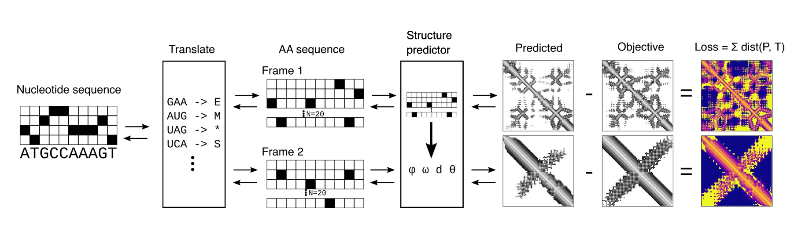

# Deprecated; designing overlapping genes by activation maximization of protein structure predictors

First attempt at designing overlapping genes encoding well folded protein structures

## How it works

Iteratively maximize a loss function which scores the probability that two different proteins translated from the same nucleotide sequence input both fold into some specified structures. For optimization, make everything differentiable and use gradient descent.

In each iteration:
1. A differentiable translator function (implemented with very simple convolutional filter) translates an input nucleotide sequence into two protein sequences in two different frames.
2. RoseTTAFold predicts structures of the two proteins.
3. Predicted pairwise inter-residue distances and orientations are scored against target or background distributions.
4. Gradient with respect to the input nucleotide sequence is calculated by backpropagation.
5. A gradient descent optimizer updates the input sequence.

Following gradient descent steps, do simulated annealing iterations to further optimize.

There are various additional loss terms to make sure we end up with valid overlapping sequence. For example, stop codons in the middle of the open reading frames are penalized.




## The wrapper

olgdesign_wrapper.py is a commandline wrapper script that can be used to execute a design job with specified parameters. 

### Usage:


```bash
usage: olgdesign_wrapper.py [-h] [--out OUT] [--weight_dir WEIGHT_DIR] [--no_f2] [--length_1 LENGTH_1] [--length_2 LENGTH_2]
                            [--alt_frame ALT_FRAME] [--offset OFFSET] [--force_aa FORCE_AA] [--last_stop] [--bkg_1 BKG_1] [--bkg_2 BKG_2]
                            [--mask_1 MASK_1] [--mask_2 MASK_2] [--mask_offset MASK_OFFSET] [--weight_kl_gd WEIGHT_KL_GD]
                            [--weight_ce_gd WEIGHT_CE_GD] [--weight_lddt_gd WEIGHT_LDDT_GD] [--weight_stop_gd WEIGHT_STOP_GD]
                            [--weight_force_gd WEIGHT_FORCE_GD] [--weight_last_gd WEIGHT_LAST_GD] [--weight_rog_gd WEIGHT_ROG_GD]
                            [--thres_rog_gd THRES_ROG_GD] [--weight_surfnp_gd WEIGHT_SURFNP_GD] [--thres_surfnp_gd THRES_SURFNP_GD]
                            [--weight_nc_gd WEIGHT_NC_GD] [--thres_nc_gd THRES_NC_GD] [--weight_kl_sa WEIGHT_KL_SA]
                            [--weight_ce_sa WEIGHT_CE_SA] [--weight_lddt_sa WEIGHT_LDDT_SA] [--weight_stop_sa WEIGHT_STOP_SA]
                            [--weight_force_sa WEIGHT_FORCE_SA] [--weight_last_sa WEIGHT_LAST_SA] [--weight_rog_sa WEIGHT_ROG_SA]
                            [--thres_rog_sa THRES_ROG_SA] [--weight_surfnp_sa WEIGHT_SURFNP_SA] [--thres_surfnp_sa THRES_SURFNP_SA]
                            [--weight_nc_sa WEIGHT_NC_SA] [--thres_nc_sa THRES_NC_SA] [--max_alpha_gd MAX_ALPHA_GD]
                            [--max_alpha_sa MAX_ALPHA_SA] [--max_aloss_gd MAX_ALOSS_GD] [--max_aloss_sa MAX_ALOSS_SA] [--device DEVICE]
                            [--starting_weights STARTING_WEIGHTS] [--lr LR] [--beta_1 BETA_1] [--beta_2 BETA_2] [--eps EPS]
                            [--lookahead_k LOOKAHEAD_K] [--lookahead_a LOOKAHEAD_A] [--gd_steps GD_STEPS] [--max_gd_steps MAX_GD_STEPS]
                            [--reset_kl RESET_KL] [--reset_steps RESET_STEPS] [--reset_kl_final RESET_KL_FINAL] [--gd_hcap GD_HCAP]
                            [--gd_hcap_max GD_HCAP_MAX] [--early_gd_stop EARLY_GD_STOP] [--plateau_gd PLATEAU_GD] [--patience_gd PATIENCE_GD]
                            [--decay_min_lr DECAY_MIN_LR] [--decay_factor_lr DECAY_FACTOR_LR] [--sa_steps SA_STEPS]
                            [--min_sa_steps MIN_SA_STEPS] [--max_mut MAX_MUT] [--init_tau INIT_TAU] [--anneal_rate ANNEAL_RATE]
                            [--min_tau MIN_TAU] [--plateau_sa PLATEAU_SA] [--patience_sa PATIENCE_SA] [--openfold] [--max_recycle MAX_RECYCLE]
                            [--out_anim] [--print_loss]

```
### Arguments

|long|default|help|
| :--- | :--- | :--- |
|`--help`||show this help message and exit|
|`--out`|`./out`|Output path prefix|
|`--weight_dir`|`./`|Path to RoseTTAFold, OpenFold (for validation) and translator net weights|
|`--no_f2`||For optimizing only protein 1 as a control (protein 2 is still predicted, which provides a "background" of structures in the alternate frame)|
|`--length_1`|`100`|Length of protein 1|
|`--length_2`|`100`|Length of protein 2|
|`--alt_frame`|`5`|Reading frame of the second protein relative to the first. 1:+1, 2:+2, 3:-0, 4:-1, 5:-2|
|`--offset`|`1`|Offset between the two protein sequences (in protein sequence length units; for example, --alt_frame 5 --offset 1 will result in total 5nt shift between the two proteins (+2 from frame, +3 from 1AAx3nt offset)|
|`--force_aa`|`None`|Forced amino acid positions; takes a text file in tab-delimited format, where each line is: Prot Pos AA (example: 1 25 H means force histidine at 25th position of protein 1)|
|`--last_stop`||Forces stop codons at the ends of protein sequences; make sure --offset is at least 1 if this is enabled|
|`--bkg_1`|`None`|Background for protein 1 - if none provided, one will be generated by sampling the predictor 100 times; see mk_bkg function in olgdesign.py)|
|`--bkg_2`|`None`|Background for protein 2|
|`--mask_1`|`None`|Mask for protein 1 (as 2D L x L tensor in pytorch); if none provided, one will be generated by setting diagonals to zero and the first/last few positions as specified by --mask_offset|
|`--mask_2`|`None`|Mask for protein 2|
|`--mask_offset`|`5`|For masking out first few amino acids to give some space at the end i.e. around fixed start and stop codons (ignored if masks are specified)|
|`--weight_kl_gd`|`3.0`|Weight for KL divergence loss during gradient descent|
|`--weight_ce_gd`|`0.0`|Weight for cross entropy loss during gradient descent; leave at 0.0 - currently calculated but should not be used for loss|
|`--weight_lddt_gd`|`0.0`|Weight for LDDT loss during gradient descent; leave at 0.0 - currently calculated but should not be used for loss|
|`--weight_stop_gd`|`2.0`|Weight for stop codon loss (this penalizes appearances of stop codons in the middle of ORF during gradient descent|
|`--weight_force_gd`|`2.0`|Weight for loss to force fixed amino acid positions during gradient descent|
|`--weight_last_gd`|`2.0`|Weight for loss to force stop codon at the end during gradient descent|
|`--weight_rog_gd`|`0.5`|Weight for radius of gyration loss during gradient descent|
|`--thres_rog_gd`|`14.0`|Threshold for radius of gyration loss during gradient descent|
|`--weight_surfnp_gd`|`10.0`|Weight for surface non-polar loss during gradient descent|
|`--thres_surfnp_gd`|`0.3`|Threshold for surface non-polar loss during gradient descent|
|`--weight_nc_gd`|`0.0`|Weight for negative net charge loss during gradient descent|
|`--thres_nc_gd`|`0.0`|Threshold for negative net charge loss during gradient descent|
|`--weight_kl_sa`|`3.0`|Weight for KL divergence loss during simulated annealing|
|`--weight_ce_sa`|`0.0`|Weight for cross entropy loss during simulated annealing; leave at 0.0 - currently calculated but should not be used for loss|
|`--weight_lddt_sa`|`0.0`|Weight for LDDT loss during simulated annealing; leave at 0.0 - currently calculated but should not be used for loss|
|`--weight_stop_sa`|`1.0`|Weight for stop codon loss during simulated annealing (this penalizes appearances of stop codons in the middle of ORF|
|`--weight_force_sa`|`2.0`|Weight for loss to force fixed amino acid positions during simulated annealing|
|`--weight_last_sa`|`2.0`|Weight for loss to force stop codon at the end during simulated annealing|
|`--weight_rog_sa`|`1.0`|Weight for radius of gyration loss during simulated annealing|
|`--thres_rog_sa`|`14.0`|Threshold for radius of gyration loss during simulated annealing|
|`--weight_surfnp_sa`|`1.0`|Weight for surface non-polar loss during simulated annealing|
|`--thres_surfnp_sa`|`0.2`|Threshold for surface non-polar loss during simulated annealing|
|`--weight_nc_sa`|`0.1`|Weight for negative net charge loss during simulated annealing|
|`--thres_nc_sa`|`-1.0`|Threshold for negative net charge loss during simulated annealing|
|`--max_alpha_gd`|`0.3`|Maximum penalty for large differences in loss between the two proteins during gradient descent|
|`--max_alpha_sa`|`0.3`|Maximum penalty for large differences in loss between the two proteins during simulated annealing|
|`--max_aloss_gd`|`0.05`|Maximum auxilary loss; this clips the contribution of ROG, surface non-polar and negative net charge losses during gradient descent|
|`--max_aloss_sa`|`100000000.0`|Maximum auxilary loss; this clips the contribution of ROG, surface non-polar and negative net charge losses during simulated annealing|
|`--device`|`cuda:0`|Device to run (currently can be *ONLY* CUDA)|
|`--starting_weights`|`None`|Starting weights; randomly initialized with Xavier normal if none provided|
|`--lr`|`0.05`|Learning rate for the inner gradient descent optimizer (ADAM)|
|`--beta_1`|`0.5`|Beta 1 for ADAM|
|`--beta_2`|`0.5`|Beta 2 for ADAM|
|`--eps`|`0.001`|Epsilon for ADAM|
|`--lookahead_k`|`5`|Lookahead outer optimizer k; set this to 1 and --lookahead_a to 1.0 at the same time to disable Lookahead|
|`--lookahead_a`|`0.5`|Lookahead outer optimizer alpha; set this to 1.0 and --lookahead_k to 1 at the same time to disable Lookahead|
|`--gd_steps`|`1000`|Total number of gradient descent iterations to run|
|`--max_gd_steps`|`5000`|Total number of gradient descent iterations (including resets)|
|`--reset_kl`|`0.35`|If average KL divergence of the two proteins are less than this value after specified number of steps, then the weights are reinitialized and optimization is restarted|
|`--reset_steps`|`100`|The number of steps after which the weights will be reinitialized if specified KL divergence metric has not been reached|
|`--reset_kl_final`|`0.7`|If average KL divergence of the two proteins are less than this value at the end of gradient descent, the weights are reinitialized and optimization is restarted|
|`--gd_hcap`|`0.75`|If KL loss for both proteins are better than this value AND the solution is not acceptable due to hard constraints such as presence of stop codons, hallucination gradient will be zero'ed out|
|`--gd_hcap_max`|`4`|Number of gradient descent iterations for which hallucination loss will be zero'ed out following an unacceptable solution|
|`--early_gd_stop`|`1.1`|Hard early stop condition for gradient descent; reaching KL loss better than this value for both proteins will terminate gradient descent loop|
|`--plateau_gd`|`0.05`|Threshold to detect plateau during gradient descent; if average KL diverence does not improve by this value within specified number of steps during gradient descent, then early stop, reset or learning rate decay is triggered|
|`--patience_gd`|`200`|Number of steps to wait for improvement in average KL divergence to detect plateau during gradient descent|
|`--decay_min_lr`|`0.01`|Minimum allowed learning rate after decay during gradient descent; falling below this value triggers early stop|
|`--decay_factor_lr`|`1.0`|Learning rate decay factor (exponential decay)|
|`--sa_steps`|`5000`|Total number of simulated annealing iterations|
|`--min_sa_steps`|`500`|Minimum number of simulated annealing iterations before early stop criterion can be applied|
|`--max_mut`|`1`|Maximum number of nucleotides to mutate in one iteration of simulated annealing|
|`--init_tau`|`0.005`|Initial temperature for simulated annealing|
|`--anneal_rate`|`1e-05`|Temperature decrement per each iteration of simulated annealing|
|`--min_tau`|`1e-05`|Minimum temperature for simulated annealing|
|`--plateau_sa`|`0.05`|Threshold to detect plateau during simulated annealing; if average KL divergence for two proteins do not improve by this number within specified number of steps, then simulated annealing is terminated|
|`--patience_sa`|`500`|Number of steps to wait for improvement in average KL divergence to detect plateau simulated annealing iterations|
|`--openfold`||Enables running OpenFold predictions for the best solution as an orthogonal validation|
|`--max_recycle`|`12`|Maximum number of recycles to use in OpenFold prediction (this sometimes significantly increases prediction accuracy)|
|`--out_anim`||Enables creating an animation of the optimization run; this can take a while (10-15 minutes for ~1000 total steps)|
|`--print_loss`||Enables printing the current loss during optimization|
